

# <!-- fit --> 基于SpringBoot的‘亭好住‘房屋租赁系统设计与实现
## 汇报人：方浩冉

---
## 研究现状

- 城市化加速，房屋租赁市场不可或缺
- 由于各地区的租房需求和市场情况不同，租房信息的精确度和及时性有待提高
- 平台提供的房源信息质量参差不齐，无法满足租房者和房东对房源信息的准确需求
- 平台的租房流程和服务标准不够统一和规范，导致用户体验不佳
- 随着市场竞争的激烈化，租房平台之间的恶性竞争现象也时有发生，给市场带来一定的不良影响
- 平台的租房流程和服务标准不够统一和规范，导致用户体验不佳

---

## 选题意义
- 有利于促进行业的信息化和智能化发展
- 提高租赁服务的质量和效率
- 为租户和房东提供更便捷的服务
- 提升租赁行业的竞争力和市场占有率

---
## 系统设计
---

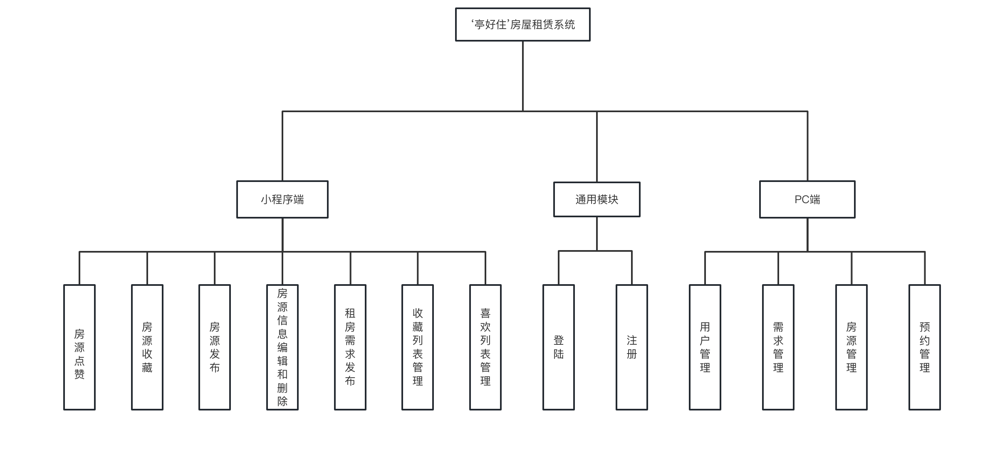

---
## 架构设计
---

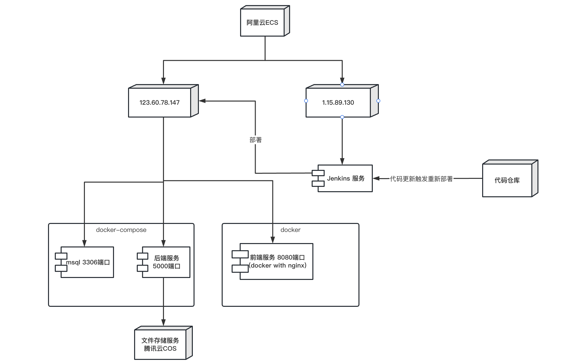

---

## 相关技术
1. [SpringBoot](https://spring.io/projects/spring-boot) 后端框架
2. [React](https://react.dev/) 后台前端框架
3. [uni-app](https://zh.uniapp.dcloud.io/) 小程序框架
4. [Mybatis-Plus](https://www.baomidou.com/pages/24112f/#%E7%89%B9%E6%80%A7) 后端ORM框架
5. [React Route](https://reactrouter.com/en/main) 前端路由框架
6. [Recoil](https://recoiljs.org/docs/introduction/installation) 一个功能类似Redux的状态管理工具
7. [Ant design](https://ant.design/components/overview-cn/)前端组件库

---
## 数据库设计
---

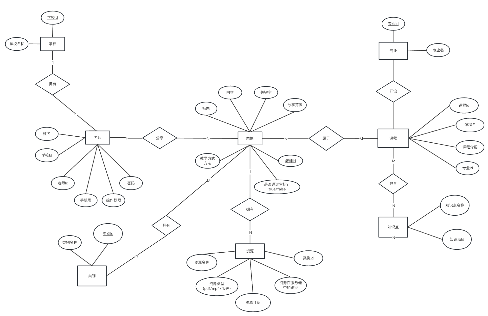

---
## 系统实现
- [jenkins server](http://1.15.89.130:8080/)
- [后台管理系统](http://123.60.78.147/)
- 源代码
  - [backend](https://gitee.com/horaoen/hourserental)
  - [frontend_admin](https://github.com/horaoen/thz_house_rental_admin)
  - [weichat_app](https://github.com/horaoen/lease-of-houses)
  - [论文](https://github.com/horaoen/dissertation)
---
### CI/CD环境搭建
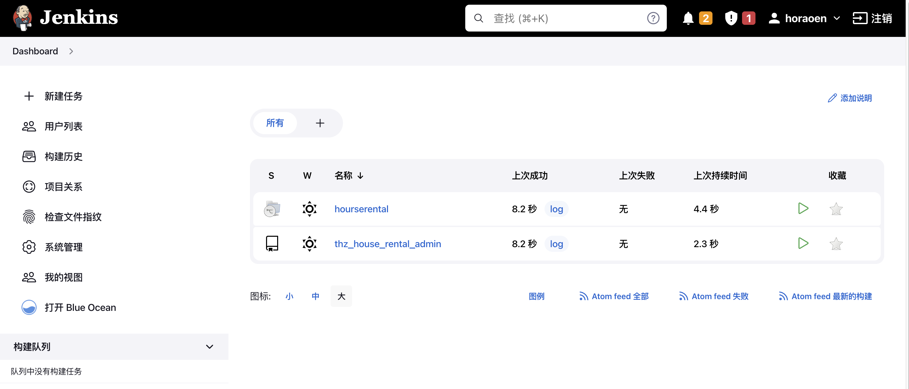

---
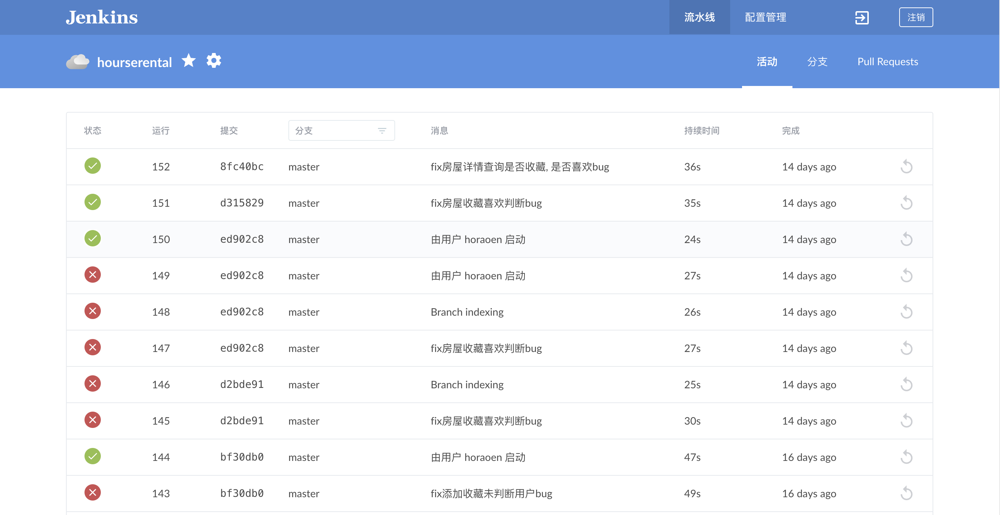
---

---
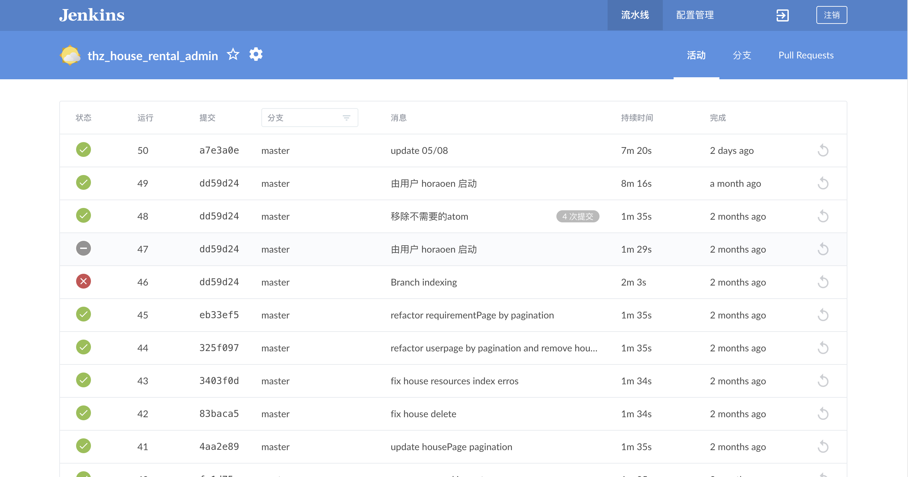

---
### 文件系统搭建
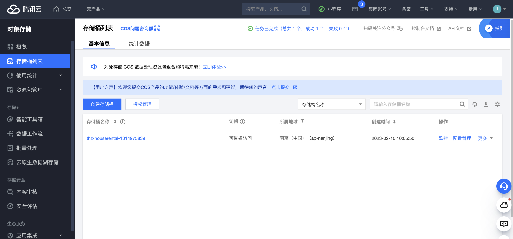
---
---
[X Spring File Storage](https://github.com/1171736840/spring-file-storage)
springboot中跨平台地将文件存储到云存储服务中
---
---
## 后台管理系统路由系统搭建
---

react router v6 配合状态管理工具recoil实现前端路由系统
1. 定义一个路由组件对象，对每一个路由和页面进行映射配置
2. 定义一个PrivateRoute组件，对每个需要权限控制的路由所映射组件进行包裹
3. PrivateRoute组件设计
   1. 从状态管理中获取token如果有则通过是私有路由
   2. 若没有尝试冲localStorage中获取token如果有则将token放入到状态管理中并通过私有路由
   3. 如果没有则重定向到登陆页

---
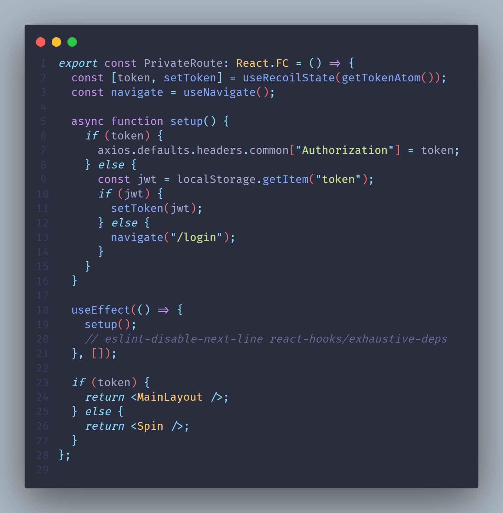
私有路由核心代码
---
---
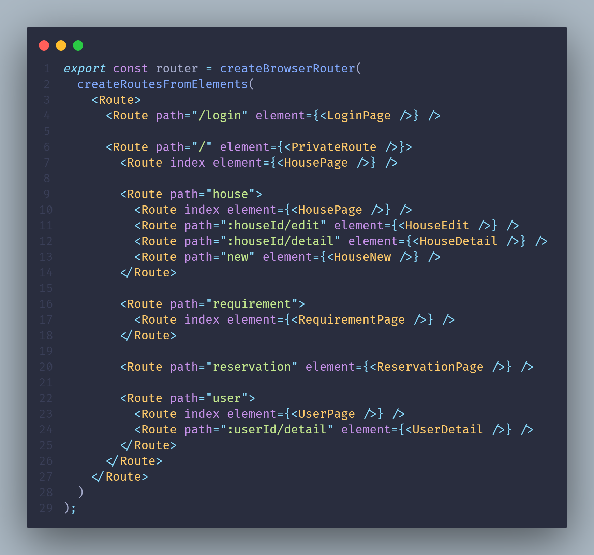
全局路由配置
---
---
## 后端权限系统
- [Authentication 和 Authorization](https://learnku.com/articles/3869/one-minute-to-clear-authentication-and-authorization)
- [Spring Security](https://docs.spring.io/spring-security/reference/index.html)
- [JSON Web Token 入门教程](https://www.ruanyifeng.com/blog/2018/07/json_web_token-tutorial.html)
---

1. 解析前端传递的token
2. 根据token信息获取userId从数据库中获取到用户详情信息放入SpringSecurityContext中
3. 需要Authentication的接口若无法从SpringSecurityContext中获取到用户的用户名密码token(UsernamePasswordAuthenticationToken), 则会访问失败
4. 需要Authorization的接口若UsernamePasswordAuthenticationToken中无限定权限则会反问失败
   - eg: 当在接口上添加注释@PreAuthorize("hasRole('ADMIN')")时, 若在UsernamePasswordAuthenticationToken中无admin角色权限，则会反问失败
   
---
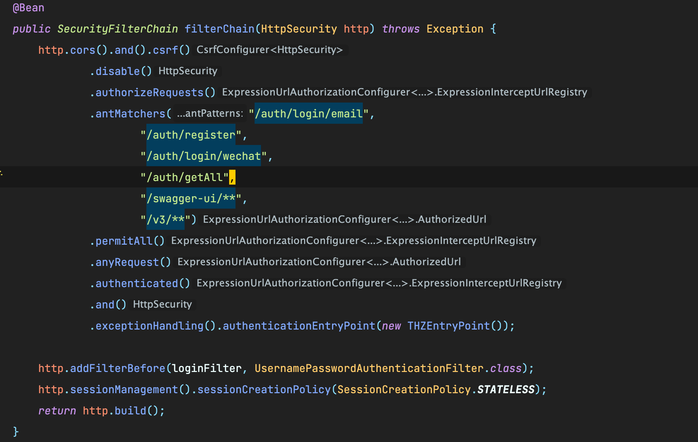
---
---
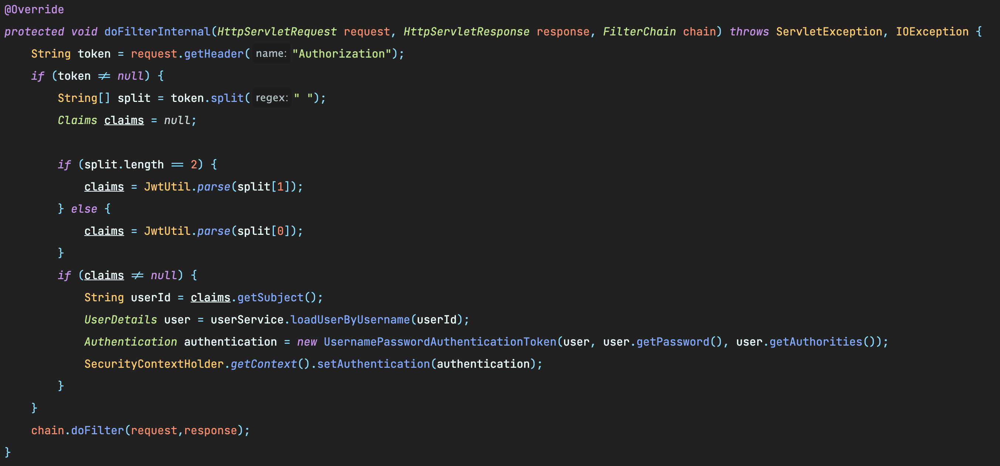
---
---

# 感谢您的倾听
- 指导教师：程辉
- 汇报人：方浩冉
